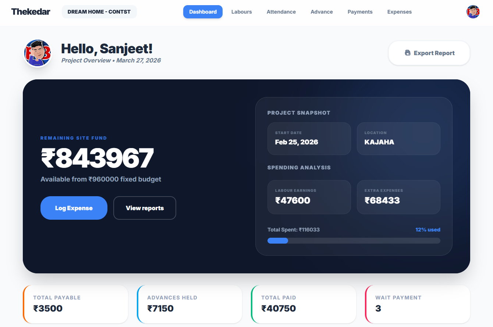
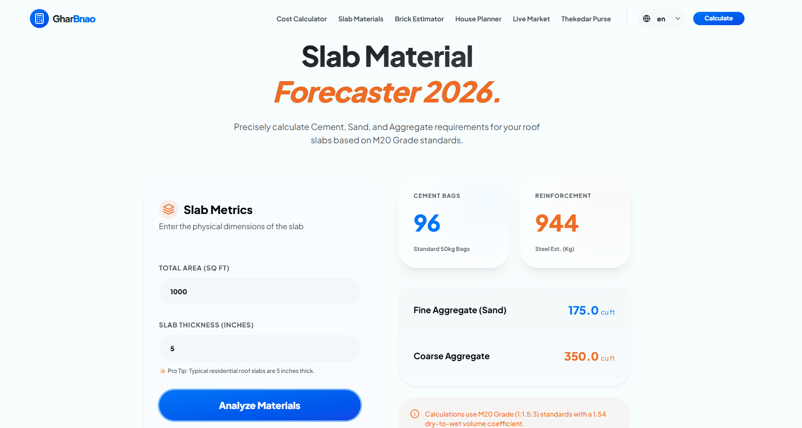
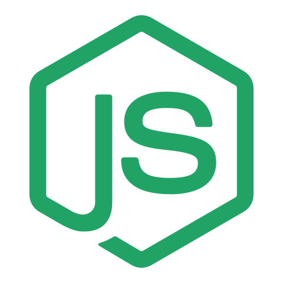
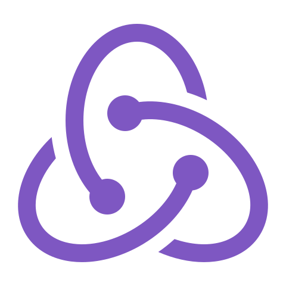

# Sanjeet Kumar Sangam | Senior Software Architect & DevOps Lead


A world-class, design-centric engineering showcase built with a **"Studio Minimalist"** aesthetic. This portfolio is engineered for high-performance visual symmetry, surgical information density, and professional social branding.

---

## 🏗️ Architectural Philosophy

The **"Studio Minimalist"** experience focuses on **Architectural Symmetry** and **Surgical Density**:
- **Symmetry-First Layout**: Globally center-aligned headings and symmetrical component grids for an intentional, premium feel.
- **Neutral Core**: A sophisticated steel-and-navy palette designed to let technical expertise and project results take center stage.
- **Modern Dividers**: Short, 2px centered visual separators purely for mobile rhythm and vertical segmentation.

### **The Profile**
<div align="center">
  
  <p align="center"><i>Engineering production-grade, high-availability ecosystems.</i></p>
</div>

---

## 💎 Surgical Engineering (Featured Projects)

### **Thekedar Dashboard**

*Managing complex construction ecosystems with a focused technical architecture.*

### **GharBnao Localization**

*High-performance bilingual digital products focused on accessibility and UX.*

---

## 🧩 Intelligent Icon & Color System

<div align="center">
  &nbsp;&nbsp;
  &nbsp;&nbsp;
  &nbsp;&nbsp;
  &nbsp;&nbsp;
  
</div>

### **Visual Tech Identity**
- **Unique Iconography**: Each technology has a distinct visual identifier to eliminate ambiguity in a label-free desktop UI.
- **Architectural Colors**: Icons use 60% saturation by default to maintain the minimal vibe, popping into 100% brand vibrancy on hover.
- **Theme Guard (Accessibility)**: A dynamic contrast system that flips low-visibility icons (e.g., Next.js, GitHub) to high-contrast dark variants in Light Mode.

---

## 🛠️ Technical Stack

- **Core**: React 18, Tailwind CSS
- **Animations**: Framer Motion (for high-fidelity transitions)
- **Icons**: Lucide Icons, React Icons (Custom Brand Mapping)
- **State Management**: Zustand (for Theme & UI State)
- **SEO**: Fully optimized OpenGraph & Social Cards

## 📁 Project Structure Overview

```text
├── public/                 # Static assets & SEO manifest.json
├── src/
│   ├── assets/             # Raw project mockups & tech iconography
│   ├── components/
│   │   ├── ui/             # Core UI components (Symmetry controllers)
│   ├── data/
│   │   └── portfolio.js    # Single-source-of-truth for all content
│   ├── pages/              # Architectural section modules
│   └── App.js              # Entry point
```

## 👨‍💻 Author

**Sanjeet Kumar Sangam**
- [LinkedIn Profile](https://linkedin.com/in/sanjeet-sangam)
- [GitHub Profile](https://github.com/sanjeet-sangam)

*Engineered with technical excellence and design precision.* 👋🏗️✨
